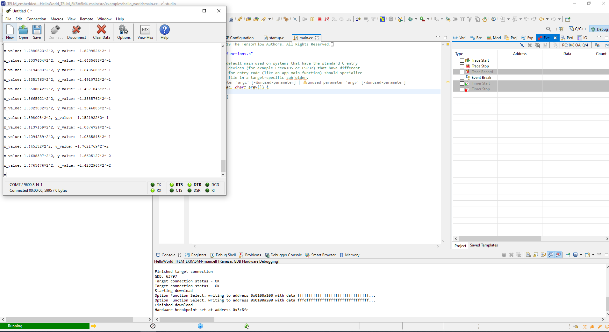

# Porting of Tensorflow lite for microcontrollers on Renesas evaluation kit.

The following repository provides the code used to port [Tensorflow Lite for Microcontrollers](https://www.tensorflow.org/lite/microcontrollers) on to Renesas RA family board, specifically the [EK-RA6M4](https://www.renesas.com/us/en/products/microcontrollers-microprocessors/ra-cortex-m-mcus/ek-ra6m4-evaluation-kit-ra6m4-mcu-group) board. 

The code executes the [Hello World project](https://github.com/tensorflow/tflite-micro/tree/main/tensorflow/lite/micro/examples/hello_world) and outputs the results through UART onto a terminal emulator using TFLM reference kernels. 

## Project Set up

The project has been developed and tested on e2 studio with flexible software package 3.4, Renesas's tool package that enables easier and faster method to develop the application code.

**CoolTerm** an open source terminal emulator that can be downloaded from [here](http://freeware.the-meiers.org/). 
To run the project, you will need EKRA6M4 board and USB to TTL UART Converter Cable.

## Running the program (A video step by step is available in the repository)

- Clone/download this repository
- Open e2 studio
- Choose a directory as a workplace and Launch 
- Import Existing Project
- In root directory, browse to where you saved the cloned/downloaded repository and select the repository(folder)
 - The project will be automatically ticked, press Finish
 - Press build (Hammer symbol), to start building the project, it will take a few minutes, so please wait.
 -  Right click on to project, Debug as, Renesas GDB Hardware Debugging, Choose your projects, Choose your device R7A6M4AF, Choose debugger (J-link), wait for project to be flashed.
 - Then press switch perspective, followed by, resume button (F8), three times, and your code will be executing. 
 - Open Cool Term and choose the correct COM to which USB to TTL UART is connected to. 
 - Once you press connect, it should start showing x and y results. Hence, your model and program has been successfully flashed. 
  

