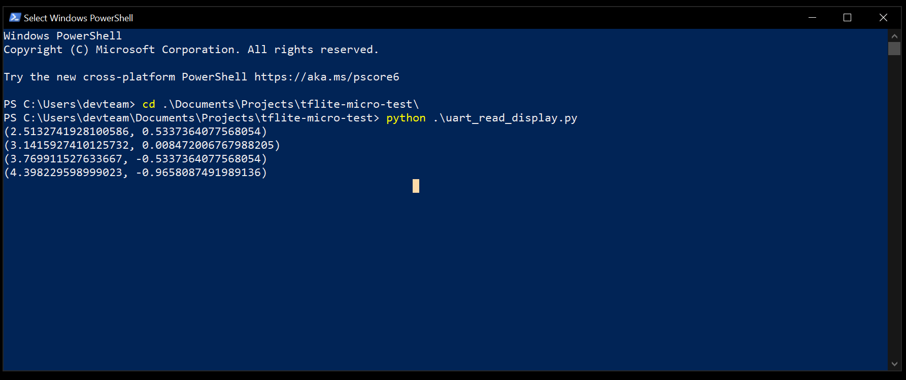

# Hello world example on VOICE-RA6E1

This project is based on the hello world project for the EKRA6M4 board, but reconfigured to work on the Renesas RA6E1 Voice kit. This project can be used as a starting template for any embedded neural network project to be deployed on the VOICE-RA6E development board. 

This project can be set up using the instructions given for the EKRA6M4 board, provided here. https://github.com/renesas/tflite-micro-renesas/tree/main/examples/EK-RA6M4/hello_world. One difference is that in this project, besides the J-Link debugger, you will need an additional UART connection via the PMOD connector on the voice board. 

A python script called "uart_read_display.py" is provided in the main project folder, which can be used to read the results directly from the board as (x,y) tuples. You may need to adjust the value of the SER_PORT variable to correspond with the UART to USB serial input on your computer. 

Running the python script should yield something that looks like this:
